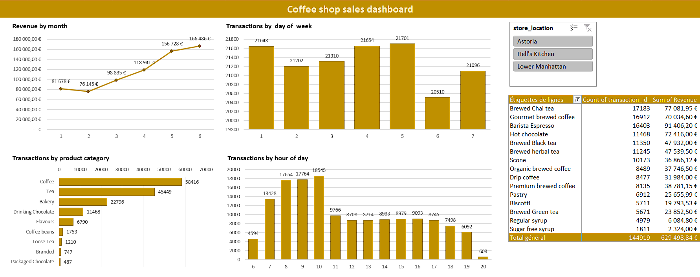

# ☕ Coffee Shop Sales Analysis

## 🕵️‍♀️ Project Context

As a new franchise owner of **Maven Roasters**, a New York–based coffee shop chain with three locations, this project was designed to better understand customer purchasing behavior and support operational decision-making through data.

The analysis is based on transactional data collected between **January and June 2023**.

---

## 🎯 Project Goal

The goal of this project is to transform raw transactional data into an **interactive Excel dashboard** that enables franchise owners to:

- Identify consumption trends  

- Detect business opportunities  

- Make data-driven decisions  

---

## 🧩 Approach \& Key Steps

### 1️⃣ Data Preparation

- Cleaned and structured raw transactional data  

- Standardized date formats, product categories, and revenue values  

- Ensured data consistency across all store locations  

### 2️⃣ Exploratory Analysis

- Built **PivotTables** in Excel  

- Analyzed sales performance by:

  - Product category  

  - Time period  

  - Store location  

  - Customer type  

### 3️⃣ Dashboard Creation

- Designed an **interactive Excel dashboard**

- Used slicers, dynamic charts, and KPIs  

- Visualized:

  - Monthly revenue trends  

  - Top-selling products  

  - Peak and off-peak hours  

  

---

## 🔍 Key Insights

- 📈 **Revenue doubled** between January and June 2023, showing steady growth  

- ☕ **Most popular product categories**:

  - Coffee (58k transactions)

  - Tea

  - Bakery  

- 🕘 **Peak hours**: Between **8:00 AM and 10:00 AM**  

- 📍 **Store performance comparison**:

  - Astoria

  - Hell’s Kitchen

  - Lower Manhattan  

- 📅 **Traffic patterns**:

  - Consistent activity on weekdays  

  - Lower footfall on Saturdays  

---

## ✅ Outcomes \& Business Impact

- Centralized view of overall business performance  

- Faster and more informed decision-making  

- Improved management of:

  - Inventory

  - Staffing

  - Promotional strategies  

---

## 🛠 Tools Used

- Microsoft Excel  

  - PivotTables  

  - Charts \& slicers  

  - Dashboard design  

---

## 📁 Project Files

- [Coffee shop sales_dashboard.xlsx](Coffee%20shop%20sales_dashboard.xlsx) – cleaned data, analysis, and dashboard

